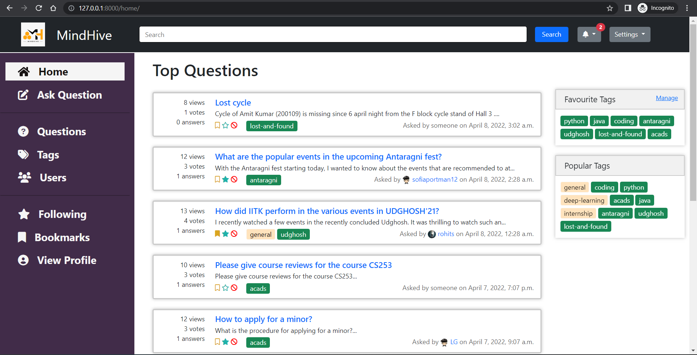

# CS253 Project MindHive
-Prof. Indranil Saha

## Group Details
| Name | Roll no. | Email Id | 
| --- | --- | --- |
|Sahil Bansal | 200836  | sbansal.sb2002@gmail.com |
|Harsh Trivedi | 200422 | harsh.trivedi.mikki@gmail.com |
|Parth Maniar  | 200671 | pmaniar1906@gmail.com |
|Ujwal Jyot Panda | 201060 | ujwal12366@gmail.com |
|Rishav Bikarwar | 200792 | ris27hav@gmail.com |
|Adi Pratap Singh | 200036 | apsinghnsa@gmail.com| 
|Aakash Om Trivedi | 200003 | aakashtri13@gmail.com| 
|Bhavya Garg | 200270 | gargs.jpr@gmail.com|
|L Gokulnath | 200542 | lgokulnath02@gmail.com |
|Gavish Garg | 200385 | gavish94170garg@gmail.com| 

## MindHive
MindHive is a portal where community members can help each other by clearing doubts that other members have asked. This is a user-friendly and easily accessible question-answer application that would save the time of the IITK junta. Basically, it is a QnA website for the IITK community. Users can ask questions and also post answers to the questions previously asked. There is also an option to give comments to questions and answers.

## Code Structure-

This repository contains an implementation/MindHive folder which contains all the code for our web app.

The project is divided into several small apps-

- Answers - represents the class of answer
- Questions - represents the class of questions
- Comments- represents the class of comments
- Users - represents the class of users
- Home - represents the home page, and contains the content class
- Notifications - implements functionalities of notifications
- Media - Contains all the images
- Tags - implements functionalities for adding tags to questions
- MindHive - app to integrate all the above apps.

Some important files/folders in each of the apps mentioned above -
- models.py - describe each object's class.
- admin.py - registers and customises the admin view for the models
- apps.py - registers apps with Django
- forms.py - contains the form to either create a new object of the given - model/class or edit the already existing object.
- urls.py - contains URL patterns that match a URL with a view for a page
- views.py - contains functions that take web requests and return web - responses
- templates - has the HTML files for the pages

Two more folders are present-
- Templates - it has the HTML files for the pages
- Static - it stores static files such as CSS and javascript files.


## How to Run 
Clone the repository-
```
git clone https://github.com/ujwaljp/CS253_Project_MindHive.git
cd CS253_Project_MindHive
```
```
cd implementation
```
Install all the dependencies-
```
pip install -r Requirements.txt
```
if it does not work then we have to install each requirements one by one.
```
cd MindHive
```
Run the server-
```
python manage.py runserver
```
Go on the localhost web address which must have been printed on the terminal

## Demo run

